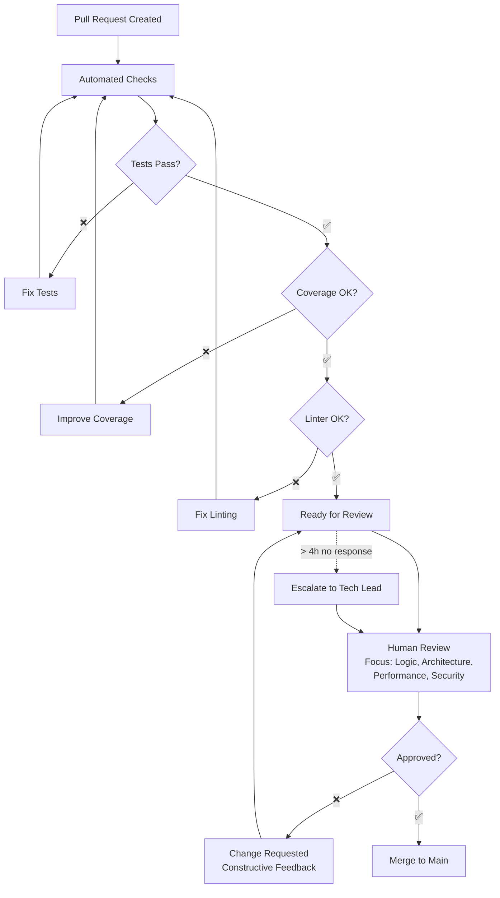
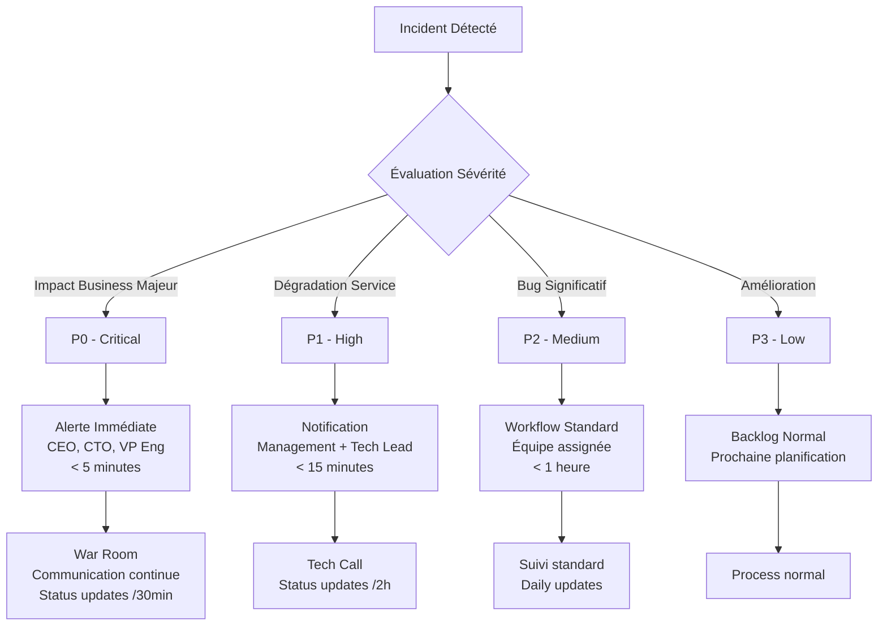
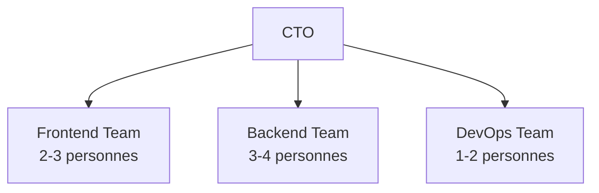
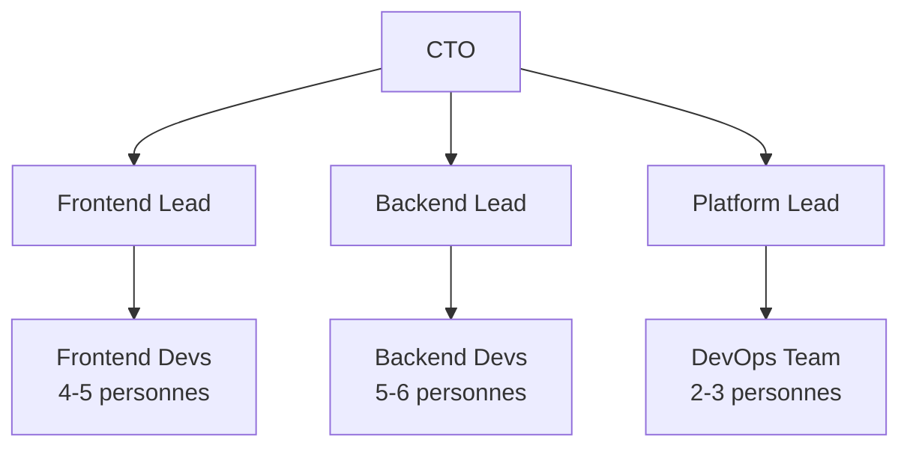
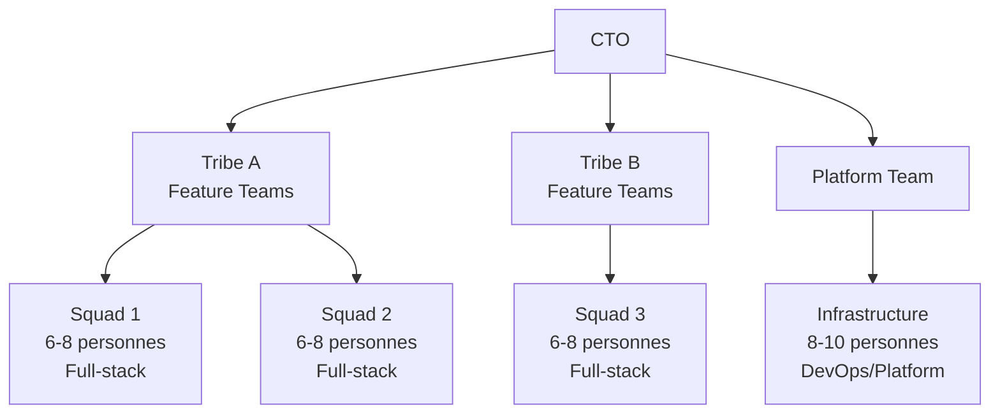
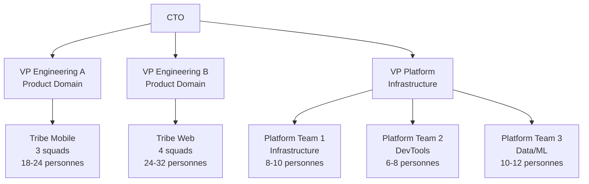

# Processus et organisation

> **Objectif :** Structurer pour scaler

Alors, on arrive au moment fatidique où votre équipe tech passe de "petite bande de copains" à "organisation qui doit livrer". Et là, c'est le drame : comment structurer sans tuer la créativité ? Comment mettre des processus sans devenir une usine à gaz bureaucratique ?

La plupart des CTOs foirent cette étape. Soit ils mettent trop de process trop tôt (death by process), soit ils n'en mettent pas assez et tout part en chaos. L'art, c'est de trouver le juste équilibre selon votre taille et votre contexte.

## Organiser les équipes (squads, tribus, etc.)

### L'évolution naturelle de l'organisation tech

**Phase 1 : L'équipe unique (1-8 personnes)**
Tout le monde fait tout, communication directe, décisions rapides.

**Problème qui arrive :** Pas de spécialisation, knowledge silos, débordement CTO

**Phase 2 : Les équipes par composant (8-20 personnes)**
Frontend, Backend, DevOps, Data

**Problème qui arrive :** Silos techniques, coordination complexe, responsabilité produit diluée

**Phase 3 : Les équipes produit (20-50 personnes)**
Chaque équipe porte une partie du produit end-to-end

**Problème qui arrive :** Duplication de compétences, coordination technique difficile

**Phase 4 : L'organisation hybride (50+ personnes)**
Mix équipes produit + équipes plateformes transverses

### Modèles d'organisation qui marchent

**Le modèle Spotify (adapté)**

**Squad (6-8 personnes) :**
- Équipe cross-fonctionnelle
- Objectifs business clairs
- Autonomie sur la tech et les méthodes
- Responsabilité end-to-end

**Tribe (30-50 personnes) :**
- Collection de squads sur un domaine métier
- Objectifs business communs
- Architecture et standards partagés
- Lead tribe (VP Engineering ou Principal Engineer)

**Guild (transverse) :**
- Communauté de pratique par expertise
- Partage de connaissances
- Standards techniques
- Pas de hiérarchie

**Le modèle "Produit-centrique"**

**Feature Teams :**
- Équipes stables dédiées à un domaine produit
- Full-stack (frontend, backend, mobile si besoin)
- Product Owner dédié
- Métriques business claires

**Platform Teams :**
- Infrastructure et outils partagés
- APIs et services communs
- Developer tooling
- Monitoring et observabilité

**Mon expérience chez Hiveo (fusion) :**
On avait 2 équipes séparées (UK + France) qui développaient sur des produits qui devaient fusionner. Cauchemar de coordination. Solution : réorganisation en 1 feature teams trans-nationales + 1 platform team. Résultat : vélocité améliorée et moins de bugs.

### Principes d'organisation qui scalent

**1. Conway's Law**
"Les organisations qui conçoivent des systèmes sont contraintes de produire des systèmes qui copient leur structure de communication."

**Implication :** Organisez vos équipes selon l'architecture que vous voulez obtenir.

**2. Two-Pizza Rule (Amazon)**
Une équipe ne doit pas nécessiter plus de 2 pizzas pour nourrir tout le monde (~6-8 personnes).

**3. Autonomy vs Alignment**
- **Alignment :** Vision, objectifs, standards communs
- **Autonomy :** Liberté sur les moyens, technologies, méthodes

**4. You Build It, You Run It**
L'équipe qui développe une feature gère sa mise en prod et son monitoring.

### Faire évoluer l'organisation

**Signaux qu'il faut réorganiser :**
- Communication qui devient difficile
- Décisions qui traînent
- Duplication d'efforts
- Responsabilités floues
- Vélocité qui stagne malgré plus de monde

**Comment réorganiser sans casser :**

**1. Commencer par les objectifs**
- Définir les domaines métier
- Identifier les responsabilités business
- Mapper avec les équipes actuelles

**2. Évoluer progressivement**
- Pas de big bang organisationnel
- Expérimenter sur une équipe
- Ajuster selon les retours

**3. Impliquer les équipes**
- Co-construction avec les leads techniques
- Transparence sur les raisons
- Formation aux nouvelles responsabilités

## Mise en place de processus sans bureaucratie

### Le paradoxe des processus

**Sans processus :** Chaos, duplication, décisions incohérentes, onboarding compliqué.

**Trop de processus :** Rigidité, lenteur, bureaucratie, perte de créativité.

**Le sweet spot :** Processus légers qui automatisent les décisions répétitives et garantissent la qualité.

### Principes de processus qui scalent

**1. Purpose-driven**
Chaque processus doit résoudre un problème concret identifié.

**2. Minimal viable process**
Commencer par le minimum nécessaire, itérer selon les besoins.

**3. Automated when possible**
Ce qui peut être automatisé ne doit pas être un processus manuel.

**4. Self-service first**
Les développeurs doivent pouvoir faire eux-mêmes sans dépendre d'autres équipes.

**5. Continuously improved**
Review trimestrielle : qu'est-ce qui marche, qu'est-ce qui ralentit ?

### Processus essentiels par phase de croissance

**Startup (1-15 personnes) :**

**Code Quality :**
- PR obligatoire avec review
- Tests automatisés en CI
- Linter configuré
- Branch protection

**Deployment :**
- CI/CD automatisé
- Staging environment
- Feature flags basics
- Rollback 1-click

**Incident Response :**
- Alerting basic
- Runbook simple
- Post-mortem si incident >1h

**Scale-up (15-50 personnes) :**

**Architecture :**
- Architecture Decision Records (ADR)
- Tech radar trimestriel
- API design guidelines
- Security review checklist

**Product Delivery :**
- Definition of Done standardisée
- Release planning process
- Product/Tech alignment rituals
- Customer feedback loops

**People :**
- Onboarding checklist
- 1-on-1 framework
- Performance review process
- Career ladder défini

**Corporate (50+ personnes) :**

**Governance :**
- Technical committee
- Budget approval process
- Risk assessment framework
- Compliance checkpoints

**Knowledge Management :**
- Documentation standards
- Knowledge sharing rituals
- Training programs
- Internal tech talks

### Exemples de processus légers qui marchent

**Process : Code Review**



**Guidelines du processus :**

```markdown
# Code Review Guidelines

## Mandatory pour toute PR
- [ ] Tests passent ✅
- [ ] Coverage maintenu ✅  
- [ ] Linter validé ✅
- [ ] 1 approbation minimum

## Ce qu'on review
🎯 **Focus sur :**
- Logic errors et edge cases
- Architecture et design patterns
- Performance et sécurité
- Lisibilité et maintenabilité

🚫 **Pas de débat sur :**
- Style (automatisé par linter)
- Préférences personnelles
- Technologies déjà choisies

## Timeline
- Review dans les 4h en journée
- Auto-merge si critique + tests passent
- Escalade à @tech-leads si blocage

## Feedback Style
✅ "Cette fonction fait trop de choses. Tu pourrais la découper ?"
❌ "Code nul"
```

**Process : Incident Response**

```markdown
# Incident Response Process

## Définition incident
- Service principal down >5min
- Perf dégradée >50% >15min  
- Données client impactées
- Sécurité compromise

## Rôles
- **Incident Commander :** Prend les décisions
- **Tech Lead :** Investigate et fixe
- **Communication Lead :** Updates stakeholders

## Actions (ordre de priorité)
1. **Mitigate** l'impact (rollback, failover)
2. **Communicate** status (Slack + status page)
3. **Investigate** cause racine
4. **Fix** définitivement
5. **Learn** via post-mortem

## Communication templates
Voir #incident-response channel
```

**Process : Architecture Decision**

```markdown
# Architecture Decision Process

## Quand créer un ADR
- Choix technique impactant >1 équipe
- Migration majeure
- Nouvelle techno en production
- Standards techniques

## Template ADR
1. **Context :** Pourquoi cette décision ?
2. **Options :** Alternatives considérées
3. **Decision :** Choix fait et rationale
4. **Consequences :** Impact attendu

## Review process
- Draft → Review équipe → Approve CTO
- Discussion async (comments)
- Meeting si désaccord
- Archive dans /docs/adr/
```

### Automatiser ce qui peut l'être

**Au lieu de processus manuels :**

**Quality Gates automatisés :**

**Décision stratégique :** Investir dans l'automatisation des contrôles qualité pour maintenir la vélocité à mesure que l'équipe grandit.

**Questions CTO à se poser :**
- Quels sont nos critères de qualité non-négociables ?
- Quel niveau d'automatisation justifie l'investissement initial ?
- Comment mesurer le ROI de l'automatisation qualité ?

**Options d'implémentation :**
- Solution cloud clé-en-main (GitHub Actions, GitLab CI, CircleCI)
- Plateforme interne avec Jenkins/TeamCity
- Hybride : CI cloud + outils maison pour les spécificités

**Décisions d'architecture :**
- Tests parallélisés vs séquentiels (coût vs vitesse)
- Niveaux de tests : unitaires, intégration, end-to-end
- Stratégie de feedback : bloquant vs informatif
- Métriques de suivi : temps de build, taux de succès, coverage

**Deployment automatisé :**

**Framework de décision :** Comment choisir votre stratégie de déploiement

**Options stratégiques :**
- **Conservative :** Déploiements manuels avec validation humaine
- **Progressive :** Automatisation par environnement (dev → staging → prod)
- **Aggressive :** Continuous deployment avec feature flags

**Critères de choix :**
- Tolérance au risque de votre business
- Maturité de vos tests automatisés
- Complexité de votre architecture
- Compétences DevOps de l'équipe

**Trade-offs à évaluer :**
- Vitesse vs contrôle
- Automatisation vs flexibilité
- Investissement initial vs gains long terme

**Onboarding automatisé :**

**Vision stratégique :** L'onboarding automatisé comme avantage concurrentiel pour attirer et retenir les talents.

**Éléments à automatiser (par ordre de priorité) :**
1. **Accès et permissions :** Annuaires, outils, droits d'accès
2. **Environnement de développement :** Configuration poste, outils, repos
3. **Formation :** Parcours personnalisé selon le profil
4. **Intégration équipe :** Attribution buddy, planning premiers jours

**ROI de l'automatisation onboarding :**
- Réduction du time-to-productivity des nouveaux développeurs
- Libération de temps des seniors pour des tâches à valeur ajoutée
- Amélioration de l'expérience candidat et de l'employer branding
- Standardisation et amélioration continue du processus

## Documentation et knowledge management

### La documentation qui scale

**Problème classique :** Documentation obsolète, dispersée, non-maintenue.

**Solution :** Documentation as Code + ownership clair.

### Niveaux de documentation

**1. Code Documentation**
- README dans chaque repo
- API documentation automatique
- Code comments pour la logique complexe
- Architecture diagrams as code

**2. Process Documentation**
- Runbooks opérationnels
- Onboarding guides
- Emergency procedures
- Decision logs (ADRs)

**3. Knowledge Documentation**
- Best practices techniques
- Lessons learned
- Troubleshooting guides
- Architecture overview

### Organisation de la documentation

**Structure qui marche :**

```
docs/
├── getting-started/
│   ├── setup-development.md
│   ├── first-contribution.md
│   └── architecture-overview.md
├── guides/
│   ├── api-design-guidelines.md
│   ├── testing-strategies.md
│   └── deployment-process.md
├── runbooks/
│   ├── incident-response.md
│   ├── database-maintenance.md
│   └── monitoring-alerts.md
├── adr/
│   ├── 001-microservices-migration.md
│   ├── 002-react-vs-vue.md
│   └── 003-database-choice.md
└── references/
    ├── api-documentation.md
    ├── coding-standards.md
    └── security-guidelines.md
```

### Maintenir la documentation à jour

**Ownership clair :**
- Chaque doc a un owner responsable
- Review trimestrielle automatique
- Outdated docs supprimées

**Documentation as Code :**
```markdown
---
owner: squad-platform
last-reviewed: 2024-01-15
next-review: 2024-04-15
tags: [infrastructure, kubernetes]
---

# Kubernetes Deployment Guide

## Quick Start
```

### Knowledge sharing rituals

**Tech Talks internes (bi-weekly)**
- 20 min presentation
- Nouveau truc appris
- Problème résolu
- Tool découvert

**Lunch & Learn (monthly)**
- Session plus longue (45 min)
- Deep dive technique
- Guest speaker externe
- Workshop hands-on

**Post-mortem partagés**
- Incidents majeurs
- Échecs projets
- Lessons learned
- Amélioration process

**Documentation challenges**
- Quarterly doc sprint
- Récompense meilleure contrib
- Gamification updates

**Mon système chez JOBO Interim :**
- Wiki central dans Notion
- Docs techniques dans repos GitHub
- Runbooks dans PagerDuty
- ADRs dans dossier `/docs`
- Review mensuelle "doc debt"

## Reporting et communication vers le management

### Les métriques qui comptent vraiment

**Pour le CEO (focus business) :**
- Features livrées vs plannifiées
- Incidents impactant clients
- Performance/availability SLA
- Coût technique vs budget

**Pour le CFO (focus financier) :**
- Budget vs dépenses réelles
- ROI investissements techniques
- Optimisations coûts cloud
- Productivité équipe tech

**Pour le CPO (focus produit) :**
- Vélocité de développement
- Quality metrics (bugs, tests)
- Time-to-market features
- Debt technique bloquante

### Dashboard executive mensuel

```markdown
# Tech Dashboard - Mars 2024

## 🎯 Executive Summary
✅ 8/8 features livrées ce mois
✅ 99.97% uptime (SLA: 99.9%)
⚠️ Budget à 103% (dans tolérance 105%)
🔴 Dette technique à 25% (target <20%)

## 📊 Delivery Metrics
- **Vélocité :** 42 story points (vs 40 target)
- **Cycle time :** 8.5 jours (vs 10 target)  
- **Déploiements :** 28 (vs 20 target)
- **Bug rate :** 0.8 bugs/feature (vs 1.2 target)

## 💰 Financial Health
- **Budget consommé :** 52K€/50K€ budget mensuel
- **Cloud costs :** 12K€ (-8% vs mois précédent)
- **ROI projets Q1 :** 156% (target 120%)

## 🔧 Technical Health
- **Incidents :** 2 minor (0 major)
- **Test coverage :** 84% (target >80%)
- **Security vulns :** 0 high/critical
- **Team satisfaction :** 8.2/10

## 🎲 Risks & Opportunities
- **Risk :** Senior dev départ fin avril
- **Mitigation :** Recrutement en cours + knowledge transfer
- **Opportunity :** New framework evaluation (+30% vélocité)
```

### Rythme de communication

**Weekly Sync avec C-Level (15 min)**
- Blockers immédiats
- Risques semaine suivante
- Décisions urgentes

**Monthly Review avec Board (30 min)**
- Dashboard complet
- ROI investissements
- Roadmap updates
- Budget variance

**Quarterly Planning (2h)**
- OKRs review
- Tech roadmap next quarter
- Budget planning
- Team scaling

### Communication de crise

**Escalation automatique :**

**Framework de décision d'escalade :** Comment structurer votre chaîne de communication de crise



**Niveaux d'escalade par sévérité :**
- **P0 (Critical) :** Impact business majeur → Alerte immédiate C-Level
- **P1 (High) :** Dégradation service → Notification équipe technique + management
- **P2 (Medium) :** Bug significatif → Workflow équipe standard
- **P3 (Low) :** Amélioration → Backlog normal

**Critères de définition à établir avec le business :**
- Seuils de revenus impactés justifiant chaque niveau
- Nombre d'utilisateurs affectés par niveau
- Durée d'incident déclenchant l'escalade
- Services critiques vs non-critiques

**Questions stratégiques pour votre organisation :**
- Qui doit être informé à quel moment ?
- Quels canaux de communication privilégier selon l'urgence ?
- Comment éviter la fatigue d'alerte (cry wolf effect) ?
- Quel niveau d'automatisation vs intervention humaine ?

**Outils et vendors à évaluer :**
- PagerDuty, Opsgenie pour la gestion d'incidents
- Slack/Teams pour la communication interne
- StatusPage, Atlassian Status pour la communication externe
- Monitoring : DataDog, New Relic, Grafana

**Template communication incident :**

```
Subject: [RESOLVED] Service disruption - 45min impact

Timeline:
- 14:23 - Issue detected (automated alert)
- 14:25 - Incident declared, team mobilized  
- 14:35 - Root cause identified (DB connection pool)
- 15:08 - Service restored, monitoring continues

Impact:
- Users affected: ~2000 (8% of active users)
- Duration: 45 minutes
- Financial impact: ~5K€ estimated lost revenue

Root cause: Database connection pool exhaustion during traffic spike

Immediate actions taken:
- Increased connection pool size
- Added alerting on pool utilization
- Improved auto-scaling configuration

Long-term improvements:
- Architecture review scheduled (next week)
- Load testing plan updated
- Capacity planning process enhanced

Next update: Post-mortem report (tomorrow)
```

## Templates de process

### Template ADR (Architecture Decision Record)

```markdown
# ADR-XXX: [Titre de la décision]

## Status
[Proposed | Accepted | Superseded | Deprecated]

## Context
[Description du contexte et du problème qui nécessite une décision]

## Decision Drivers
- [Driver 1]
- [Driver 2]
- [Driver 3]

## Considered Options
- [Option 1]
- [Option 2]
- [Option 3]

## Decision Outcome
Chosen option: "[Option X]", because [justification].

## Positive Consequences
- [Conséquence positive 1]
- [Conséquence positive 2]

## Negative Consequences
- [Conséquence négative 1]
- [Conséquence négative 2]

## Pros and Cons of the Options

### [Option 1]
- Good: [argument a]
- Good: [argument b]
- Bad: [argument c]
- Bad: [argument d]

### [Option 2]
- Good: [argument a]
- Good: [argument b]
- Bad: [argument c]
- Bad: [argument d]

## Links
- [ADR-XXX: Related decision]
- [Documentation relevante]

---
Date: [YYYY-MM-DD]
Décideurs: [Liste des personnes]
Consultés: [Liste des personnes consultées]
```

### Template Post-Mortem

```markdown
# Post-Mortem: [Titre de l'incident]

## Incident Summary
**Date:** [Date]
**Duration:** [Durée]  
**Impact:** [Description de l'impact]
**Severity:** [Critical | High | Medium | Low]

## Timeline
| Time | Event | Action Taken | Owner |
|------|-------|--------------|-------|
| HH:MM | [Événement] | [Action] | [Personne] |

## Root Cause Analysis
### What Happened
[Description factuelle des événements]

### Why It Happened
[Analyse de la cause racine - focus sur les processus, pas les personnes]

### Why We Didn't Catch It Earlier
[Analyse des systèmes de détection et prévention]

## Impact Assessment
- **Users affected:** [Nombre]
- **Duration:** [Durée]
- **Services impacted:** [Liste]
- **Data integrity:** [OK | Affected]
- **Financial impact:** [Estimation]

## What Went Well
- [Point positif 1]
- [Point positif 2]

## What Went Poorly
- [Point négatif 1]
- [Point négatif 2]

## Action Items
| Action | Owner | Due Date | Status |
|--------|-------|----------|--------|
| [Action 1] | [Personne] | [Date] | [Open/Closed] |
| [Action 2] | [Personne] | [Date] | [Open/Closed] |

## Lessons Learned
[Apprentissages pour éviter des incidents similaires]

---
**Facilitator:** [Nom]
**Attendees:** [Liste]
**Date:** [Date]
```

### Template Onboarding Checklist

```markdown
# Onboarding Checklist - [Nom]

## Before Day 1
- [ ] Hardware ordered and configured
- [ ] Accounts created (GitHub, Slack, AWS, etc.)
- [ ] Buddy assigned: [Nom]
- [ ] First week calendar blocked
- [ ] Welcome email sent with logistics

## Day 1
- [ ] Welcome meeting with manager (1h)
- [ ] Office tour and introductions
- [ ] IT setup completed
- [ ] First commit pushed to test repo
- [ ] Lunch with team

## Week 1
- [ ] Company/product overview session
- [ ] Architecture deep-dive with tech lead
- [ ] Shadow buddy on real tasks
- [ ] Read key documentation
- [ ] Complete first small fix/feature

## Week 2-4
- [ ] Own first real feature
- [ ] Participate in all team rituals
- [ ] 1-on-1 with manager
- [ ] Feedback session with buddy

## Month 2
- [ ] Mentor another new joiner
- [ ] Propose first improvement
- [ ] Give first tech talk
- [ ] 30-day review completed

## Month 3
- [ ] Fully autonomous on domain
- [ ] Contributing to architectural decisions
- [ ] 90-day review completed
- [ ] Career plan discussed

---
**Manager:** [Nom]
**Buddy:** [Nom]
**Start Date:** [Date]
```

## Structures d'équipes selon la taille

### 5-15 personnes : L'équipe unique



**Avantages :**
- Communication directe
- Décisions rapides
- Flexibilité maximale

**Challenges :**
- Spécialisation limitée
- CTO overwhelmé
- Knowledge silos

### 15-30 personnes : Équipes par composant



**Avantages :**
- Spécialisation technique
- Scaling possible
- Expertise focused

**Challenges :**
- Coordination complexe
- Silos techniques
- Ownership flou

### 30-80 personnes : Équipes produit



**Avantages :**
- Ownership business claire
- Autonomie des équipes
- Scaling organisation

**Challenges :**
- Duplication compétences
- Coordination technique
- Standards consistency

### 80+ personnes : Organisation hybride



**Avantages :**
- Spécialisation avancée
- Leadership distribué
- Scaling optimal

**Challenges :**
- Coordination complexe
- Risk de silos
- Overhead management

## Checklist : "Mon organisation scale-t-elle ?"

### 🎯 Clarity et Ownership

- [ ] **Chaque équipe a des objectifs business clairs**
  - KPIs définis et mesurés
  - Lien direct avec impact utilisateur
  - Ownership end-to-end

- [ ] **Responsabilités techniques non-ambiguës**
  - Qui fait quoi est documenté
  - Escalation paths définis
  - Ownership de chaque service/composant

- [ ] **Decision making distribué mais cohérent**
  - Équipes autonomes dans leur domaine
  - Standards techniques partagés
  - Processus d'escalade clairs

### 🤝 Communication et Coordination

- [ ] **Communication intra-équipe fluide**
  - Daily syncs efficaces (<15min)
  - Conflits résolus rapidement
  - Knowledge sharing actif

- [ ] **Communication inter-équipes structurée**
  - APIs et contrats clairs
  - Dependencies explicites
  - Roadmap synchronisée

- [ ] **Alignment vertical management-équipes**
  - OKRs cascadés et compris
  - Feedback loops réguliers
  - Transparence sur la stratégie

### ⚡ Velocity et Delivery

- [ ] **Time-to-market prévisible**
  - Estimations fiables
  - Scope creep maîtrisé
  - Delivery régulière

- [ ] **Quality gates automatisés**
  - CI/CD robuste
  - Tests automatisés
  - Security scanning

- [ ] **Déploiements sans stress**
  - Rollback possible
  - Monitoring en place
  - Feature flags utilisées

### 🔧 Technical Health

- [ ] **Architecture qui scale avec l'organisation**
  - Services alignés avec équipes
  - APIs bien définies
  - Monitoring distribué

- [ ] **Dette technique maîtrisée**
  - <20% du temps sur la dette
  - Refactoring planifié
  - Code quality maintenu

- [ ] **Knowledge management efficace**
  - Documentation à jour
  - Onboarding <2 semaines
  - Bus factor >1 partout

### 👥 People et Culture

- [ ] **Équipes stables et motivées**
  - Turnover <20%/an
  - Satisfaction >7/10
  - Career paths clairs

- [ ] **Learning et growth continu**
  - Formation budgétée et utilisée
  - Tech talks réguliers
  - Expérimentation encouragée

- [ ] **Leadership technique distribué**
  - Tech leads dans chaque équipe
  - Mentoring actif
  - Succession planning

### 📊 Metrics et Feedback

- [ ] **Métriques de productivité suivies**
  - Lead time, cycle time
  - Deployment frequency
  - MTTR (Mean Time To Recovery)

- [ ] **Business impact mesurable**
  - Features usage trackées
  - A/B tests réguliers
  - Customer feedback loops

- [ ] **Continuous improvement culture**
  - Retrospectives actionables
  - Expérimentations mesurées
  - Échecs documentés et partagés

### 🎲 Scaling Readiness

- [ ] **Recrutement scalable**
  - Process standardisé
  - Onboarding automatisé
  - Employer brand forte

- [ ] **Infrastructure qui anticipe la croissance**
  - Auto-scaling configuré
  - Monitoring proactif
  - Capacity planning régulier

- [ ] **Processus qui évoluent avec la taille**
  - Review trimestrielle des process
  - Automatisation continue
  - Bureaucratie évitée

### 📈 Scoring

**25-30 ✅ :** Organisation excellente, prête pour la croissance
**20-24 ✅ :** Bonne base, quelques améliorations à planifier
**15-19 ⚠️ :** Organisation fragile, refactoring organisationnel nécessaire
**< 15 🚨 :** Organisation dysfonctionnelle, restructuration urgente

## Points clés à retenir

1. **Organisez selon votre architecture cible.** Conway's Law n'est pas une suggestion, c'est une loi physique.

2. **Processus légers et purpose-driven.** Chaque processus doit résoudre un problème réel et être continuellement amélioré.

3. **Documentation as Code.** Ownership clair, tests automatisés, review régulières.

4. **Communication adaptée à l'audience.** Technique pour les équipes, business pour le management.

5. **Automatisez tout ce qui peut l'être.** Les humains pour les décisions, les machines pour l'exécution.

6. **Évolution continue.** Votre organisation doit s'adapter à votre croissance, pas l'inverse.

Dans le prochain chapitre, on va parler de scaling et de croissance. Parce qu'avoir de bons processus, c'est bien, mais savoir les faire évoluer avec la croissance de l'entreprise, c'est encore mieux !

---

*"Une bonne organisation, c'est comme un bon code : ça marche même quand les gens changent."*